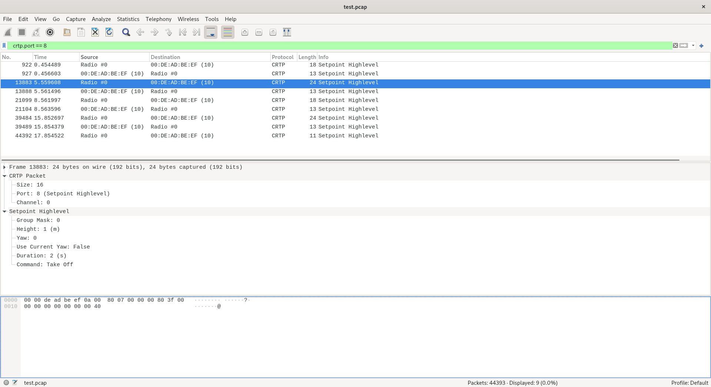

Wireshark is a free and open-source packet analyzer. It is used for network troubleshooting, analysis, software and communications protocol development, and education. It makes analyzing what is going on with packet based protocols easier.

We have written a plugin to Wireshark that can display [CRTP](https://www.bitcraze.io/documentation/repository/crazyflie-firmware/master/functional-areas/crtp/) packets (what this library uses to communicate with Crazyflies).



In order for Wireshark (and our dissector plugin) to be able to decode CRTP you need to do *two* things:

## 1. Install the plugin crtp-dissector.lua

Wireshark looks for plugins in both a personal plugin folder and a global plugin folder. Lua plugins are stored in the plugin folders; compiled plugins are stored in subfolders of the plugin folders, with the subfolder name being the Wireshark minor version number (X.Y). There is another hierarchical level for each Wireshark plugin type (libwireshark, libwiretap and codecs). So for example the location for a libwireshark plugin foo.so (foo.dll on Windows) would be PLUGINDIR/X.Y/epan (libwireshark used to be called libepan; the other folder names are codecs and wiretap).

On Windows:

- The personal plugin folder is %APPDATA%\Wireshark\plugins.
- The global plugin folder is WIRESHARK\plugins.

On Unix-like systems:

- The personal plugin folder is ~/.local/lib/wireshark/plugins.

Copy the `tools/crtp-dissector.lua` file into the personal plugin folder and restart Wireshark or hit `CTRL+SHIFT+L`

## 2. Generate a [PCAP](https://en.wikipedia.org/wiki/Pcap) file

The de facto standard network packet capture format is libpcap (pcap), which is used in packet analyzers such as tcpdump/WinDump and Wireshark. The pcap file format is a binary format, with support for nanosecond-precision timestamps.

To tell the CFLIB to generate a PCAP file of what it thinks the CRTP traffic looks like you can go:

```bash
$ CRTP_PCAP_LOG=filename.pcap python3 examples/swarm/hl-commander-swarm.py
$ wireshark filename.pcap
```
To generate a PCAP file and open it with Wireshark. You can also use the text based `tshark` tool, and you can add a filter, for instance, only shoow CRTP port 8 (Highlevel setpoint):

```bash
$ tshark -r test.pcap "crtp.port == 8"
    6   0.003333 00:DE:AD:BE:EF (10) → Radio #0     CRTP 13 Setpoint Highlevel
13158   5.176752     Radio #0 → 00:DE:AD:BE:EF (10) CRTP 24 Setpoint Highlevel
13163   5.178626 00:DE:AD:BE:EF (10) → Radio #0     CRTP 13 Setpoint Highlevel
17768   8.179085     Radio #0 → 00:DE:AD:BE:EF (10) CRTP 32 Setpoint Highlevel
17773   8.181294 00:DE:AD:BE:EF (10) → Radio #0     CRTP 13 Setpoint Highlevel
21223  10.181543     Radio #0 → 00:DE:AD:BE:EF (10) CRTP 32 Setpoint Highlevel
21228  10.183293 00:DE:AD:BE:EF (10) → Radio #0     CRTP 13 Setpoint Highlevel
24030  12.182588     Radio #0 → 00:DE:AD:BE:EF (10) CRTP 32 Setpoint Highlevel
24035  12.185723 00:DE:AD:BE:EF (10) → Radio #0     CRTP 13 Setpoint Highlevel
26449  14.184183     Radio #0 → 00:DE:AD:BE:EF (10) CRTP 32 Setpoint Highlevel
26454  14.185862 00:DE:AD:BE:EF (10) → Radio #0     CRTP 13 Setpoint Highlevel
28388  16.187258     Radio #0 → 00:DE:AD:BE:EF (10) CRTP 24 Setpoint Highlevel
28393  16.188963 00:DE:AD:BE:EF (10) → Radio #0     CRTP 13 Setpoint Highlevel
30533  18.190823     Radio #0 → 00:DE:AD:BE:EF (10) CRTP 11 Setpoint Highlevel
```

Happy hacking!
